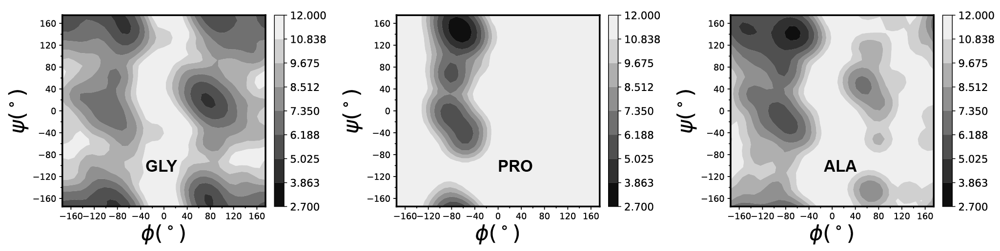

# Protein Coil Library
The protein coil library consists of fragments that lie outside regular secondary structures. Secondary structure is formally defined by the pattern of hydrogen bonds between the amino hydrogen and carboxyl oxygen atoms in the peptide backbone. To construct a proper coil library, the following steps have been implemented:
* Firstly, all protein crystal structures were downloaded from the Protein Data Bank, but only those with a resolution of less than 2.0 Å, an observed R factor value of less than 0.2, or a free R factor value of less than 0.2 were used in the next step.
* Secondly, we used BLAST to calculate sequence identity and applied a 50% sequence identity cutoff to filter the proteins.
* Then, we used `DSSP` to assign the secondary structure to all residues in the proteins. Any residue assigned to a secondary structure was discarded. Pre-Pro (preceding proline) residues were also excluded to avoid the neighbor residue effect (NRE) of proline.
* To validate the protein coil library, we generated Ramachandran plots for GLY, ALA, and PRO. These plots closely resemble those presented in previous studies $^{[1]}$.

<div style="text-align: center;">
  
  <p><strong>Figure 1:</strong> A descriptive caption explaining the figure.</p>
</div>

## Get sequences 、resolution and R value from CIF
As mentioned above, only proteins with a resolution less than 2.0 Å, an R value less than 0.2, and generated by diffraction will be adopted. Therefore, one would need to run `GetResolutionAndRvalue.py` to obtain the associated data. To calculate sequence identity, one should first run `ExtractSequencesFromCIF.py` to obtain the protein sequences.  It may be better to separate all protein into multiple more smaller parts to deal data more quickly. 

## Calculate sequence identity
**Create a database for all sequences in Proteins Bank Data**
```
makeblastdb -in totseq.fasta -dbtype prot -title totseqdata -out totseqdata
```
  - `-in`: the file that contains all sequences.
  - `-dtype`: the type of database: 'prot' refers to the protein type.
  - `-title`: the name of generated database.

**Use BLASTP for protein sequence matching, extract the identity information from the results, and generate the sequence identity matrix**
```
blastp -db data -query query.fasta -outfmt 6 -out blastp.txt
```
  - `-query`: the query sequences.
  - `-outfmt`: Specify the format of the output data, which includes 12 types. Selecting type 6 outputs the data as a table.
  - `-out`: The output file. If not specified, the result will be output to the console.

output: 
```
6K9J_A	6K9J_A	100.000	104	0	0	1	104	1	104	2.25e-77	212
6K9J_A	9FE0_D	29.630	27	17	1	42	66	80	106	3.1	15.0
6K9J_A	9FE0_D	32.558	43	16	3	66	101	301	337	5.1	14.2
6K9J_A	9FE0_B	29.630	27	17	1	42	66	80	106	3.1	15.0
6K9J_A	9FE0_B	32.558	43	16	3	66	101	301	337	5.1	14.2
```
sequence identity is located at third column. It may be better to separate all protein sequences into multiple parts to generate the sequence identity matrix more quickly. Then, you can use the Construct_sequence_database_w_identity.py script to construct a library with a specific sequence identity cutoff in blastb_fulfilseqidentity.

****

## Construct Protein Coil Library
After performing the above steps, one needs to run ReadMMCIF_biophy_exclude_notfulfil_seqiden.py to construct the Protein Coil Library. The Protein Coil Library is archived as `proteinCoilLibrary.tar.gz`.

## plot Ramachandran
a 2D Gaussian kernel estimator was used to extract $\phi$, $\psi$ distributions, considering the periodicity of the dihedral angles:
$$
n(\phi, \psi) = \sum_{i}\omega_{i}\frac{exp[-min(|\phi_i - \phi|, 360 - |\phi_i - \phi|)^2 + min(|\psi_i - \psi|,360 - |\psi_i - \psi|)^2}{2\sigma^2}]
$$

Here $i$ counts for all residues of given type in the coil library, and $w_i$ is the 1/m weighting for m identical chains in one PDB structure.$\phi_i$  and $\psi_i$ are the observed backbone dihedral anglesfor residue $i$.$^{2}$ 10° × 10° grids of (ϕ, ψ) and σ = 10° were used. all scripts are in `ramachandran` folder

## **Reference**
* [1] Jiang, F., Han, W., & Wu, Y. D. (2010). Influence of side chain conformations on local conformational features of amino acids and implication for force field development. The Journal of Physical Chemistry B, 114(17), 5840-5850.
* [2]  Jiang, F., Zhou, C. Y., & Wu, Y. D. (2014). Residue-specific force field based on the protein coil library. RSFF1: modification of OPLS-AA/L. The Journal of Physical Chemistry B, 118(25), 6983-6998.
